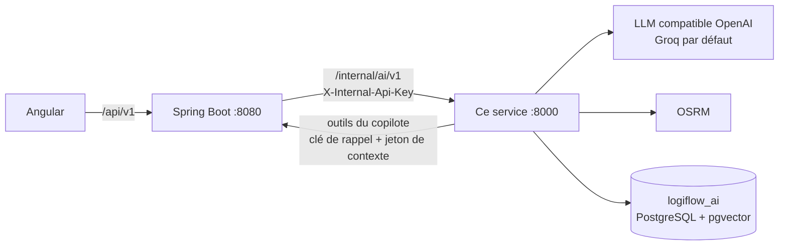

# LogiFlow AI Service

Service Flask qui héberge les **agents d'intelligence artificielle** du TMS LogiFlow :

| Agent | Ce qu'il fait |
|---|---|
| **Copilote** (chatbot) | Répond en langage naturel, en streaming, à partir des données du TMS (via les outils métier de Spring), de la documentation (base de connaissance vectorielle) et des connaissances du LLM. Les conversations sont persistées. |
| **Planification de voyage** | Pour une période et un type de voyage, propose plusieurs voyages complets et comparés : dossiers groupés, arrêts et horaires, tracteur, remorque, chauffeurs, indicateurs, justification. |
| **Maintenance prédictive** | Pour chaque véhicule et remorque : score de santé, échéances projetées, anomalies (documents, pannes répétées, sinistralité, surconsommation…) et interventions recommandées sur un créneau libre. |
| **Itinéraire** | Distance, durée et segments routiers entre des points (OSRM). |

Il est appelé **exclusivement par le backend Spring Boot** (`logiflow-backend`), sur le réseau
interne, jamais par le frontend.



## Documentation

| Document | Contenu |
|---|---|
| [docs/architecture.md](docs/architecture.md) | Structure du code, cycle de vie des requêtes, streaming du copilote, erreurs, observabilité, tests, déploiement |
| [`logiflow-backend/docs/agents-ia.md`](../logiflow-backend/docs/agents-ia.md) | **Guide complet des agents** : flux de connexion, authentification, diagrammes de séquence, règles de calcul, dégradation, configuration, dépannage |
| [`logiflow-backend/docs/integration-ia.md`](../logiflow-backend/docs/integration-ia.md) | Contrat d'API champ par champ |
| `logiflow-backend/docs/adr/0004`, `0005`, `0006` | Décisions : copilote, planification, maintenance |

## Prérequis

- **Python 3.13** et [**uv**](https://docs.astral.sh/uv/) (dépendances et environnement).
- **PostgreSQL + pgvector** pour la base propre du service, `logiflow_ai`. Elle est fournie par
  le conteneur du backend (`make up` dans `logiflow-backend`) et créée par
  `docker/postgres/init/02-ai-database.sql`.
- Une **clé API d'un fournisseur LLM compatible OpenAI**. Par défaut Groq, dont le palier
  gratuit suffit : https://console.groq.com/keys. Gemini, Mistral, OpenRouter et OpenAI se
  configurent de la même façon (voir `.env.example`).
- Accès réseau à OSRM (`router.project-osrm.org` par défaut, ou une instance auto-hébergée).
- Le backend Spring démarré, pour que le copilote puisse appeler les outils métier.

## Démarrage

```bash
cp .env.example .env        # puis renseigner LLM_API_KEY
make install                # dépendances (uv sync)
make migrate                # schéma copilote dans logiflow_ai (Alembic)
make ingerer SOURCES="../logiflow-backend/docs/*.md"   # optionnel : base de connaissance
make run                    # http://localhost:8000
```

```bash
curl http://localhost:8000/health
# {"status": "UP", "dependances": {"llm": "UP", "base": "UP"},
#  "modele": "openai/gpt-oss-120b", "fournisseur": "api.groq.com"}
```

`/health` répond toujours 200 tant que le processus tourne. L'état du LLM et de la base est
détaillé dans `dependances`.

Si le volume PostgreSQL existait avant l'ajout de la base IA, il faut créer la base une fois :

```bash
docker exec -i logiflow-postgres psql -U logiflow -d logiflow < ../logiflow-backend/docker/postgres/init/02-ai-database.sql
```

Pour tester depuis l'interface, démarrez aussi le backend (profil `local`) et le frontend, puis
ouvrez le panneau **Copilote**, le mode **assisté** de création de voyage ou le **tableau de
bord Maintenance**.

## Configuration (`.env`)

Toutes les variables sont décrites dans [.env.example](.env.example). Les plus importantes :

| Variable | Rôle | Doit correspondre à |
|---|---|---|
| `INTERNAL_API_KEY` | Clé que Spring présente dans `X-Internal-Api-Key` | `AI_SERVICE_API_KEY` du backend |
| `BACKEND_CALLBACK_API_KEY` | Clé que ce service présente à Spring pour les outils | `AI_SERVICE_CALLBACK_API_KEY` du backend |
| `BACKEND_BASE_URL` | URL du backend (outils du copilote) | `http://localhost:8080` en local |
| `BACKEND_TIMEOUT_S` | Délai d'un appel d'outil (60 s : `proposer_voyages` peut être long) | — |
| `DATABASE_URL` | Base `logiflow_ai` | Conteneur PostgreSQL du backend (port 5433) |
| `LLM_BASE_URL`, `LLM_API_KEY`, `LLM_MODEL` | Fournisseur et modèle LLM | — |
| `EMBED_BASE_URL`, `EMBED_API_KEY`, `EMBED_MODEL` | Embeddings de la base de connaissance (facultatif) | — |
| `COPILOTE_MAX_ITERATIONS_OUTILS` | Tours d'outils par message (4 par défaut) | — |
| `COPILOTE_HISTORIQUE_MAX` | Messages d'historique envoyés au LLM (20 par défaut) | — |
| `COPILOTE_BATTEMENT_S` | Intervalle des événements `attente` pendant les silences (10 s) | — |
| `OSRM_BASE_URL` | Moteur de routing | — |

> Le fichier `.env` n'est **jamais** versionné : il contient la clé LLM.

## Endpoints

Tous sont préfixés `/internal/ai/v1` et protégés par `X-Internal-Api-Key`, sauf `/health`.

| Méthode et route | Rôle |
|---|---|
| `GET /health` | **Public** : état du service, du LLM (`UP`, `CLE_ABSENTE`, `CLE_INVALIDE`, `MODELE_ABSENT`, `DOWN`) et de la base |
| `GET` / `POST /copilot/conversations` | Lister ou créer une conversation (utilisateur dans `X-Utilisateur-Id`) |
| `GET` / `PATCH` / `DELETE /copilot/conversations/<id>` | Détail, renommage, suppression |
| `POST /copilot/conversations/<id>/messages` | Question → réponse **`text/event-stream`** (`meta`, `attente`, `outil`, `token`, `sources`, `titre`, `fin`, `erreur`) |
| `POST /copilot/messages/<id>/feedback` | Avis 👍 / 👎 |
| `POST /copilot/ask` | Question unique sans historique (ancienne version) |
| `POST /planification/proposer` | Propositions de voyages comparées |
| `POST /maintenance/recommander` | Analyse de maintenance prédictive |
| `POST /itinerary/calculer` | Itinéraire routier |

## Commandes (`Makefile`)

| Commande | Effet |
|---|---|
| `make install` | Installe les dépendances (`uv sync`) |
| `make run` | Serveur de développement sur le port 8000 (mode debug, rechargement automatique) |
| `make migrate` | Applique les migrations Alembic sur `DATABASE_URL` |
| `make ingerer SOURCES=…` | Ingère des fichiers `.md`, `.html` ou `.txt` dans la base de connaissance |
| `make test` | Suite de tests (pytest) |
| `make lint` | Vérifications Ruff |
| `make format` | Formatage Ruff |

Sans `uv`, l'environnement virtuel du projet fonctionne aussi :
`.venv/Scripts/python -m pytest` (Windows) ou `.venv/bin/python -m pytest`.

## Tests

```bash
make test
```

- Les appels sortants (LLM, OSRM, outils Spring) sont simulés avec `respx`, et les repositories
  sont en mémoire : aucun réseau n'est nécessaire.
- Les solveurs de planification et de maintenance sont testés sur leurs fonctions pures.
- Les tests des repositories SQL ne s'exécutent que si `TEST_DATABASE_URL` pointe vers une base
  PostgreSQL + pgvector jetable.

## Déploiement

L'image Docker (`Dockerfile`) applique les migrations au démarrage, puis lance gunicorn avec des
workers `gthread`, adaptés aux flux SSE longs du copilote. Le service doit rester sur le réseau
interne du backend, sans exposition publique.

## Dépannage

| Symptôme | Cause probable | Solution |
|---|---|---|
| `/health` → `llm: CLE_ABSENTE` | `LLM_API_KEY` vide | Renseigner la clé dans `.env`, puis relancer |
| `/health` → `llm: CLE_INVALIDE` ou `MODELE_ABSENT` | Clé refusée, ou modèle inexistant sur le compte | Vérifier la clé et `LLM_MODEL` |
| `/health` → `base: DOWN` | PostgreSQL arrêté, ou base `logiflow_ai` absente | `make up` côté backend ; créer la base (voir Démarrage) ; `make migrate` |
| 401 sur toutes les routes | `INTERNAL_API_KEY` ≠ `AI_SERVICE_API_KEY` | Aligner les deux clés |
| Le copilote répond sans données du TMS | Outils refusés ou backend injoignable | Vérifier `BACKEND_BASE_URL` et `BACKEND_CALLBACK_API_KEY` |
| Erreur `QUOTA_LLM` | Quota gratuit atteint | Attendre, ou choisir un modèle plus léger (`openai/gpt-oss-20b`) |
