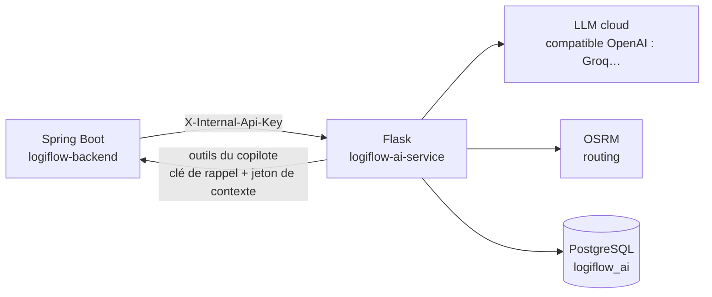

# Architecture

## Rôle du service

`logiflow-ai-service` héberge les agents IA du TMS LogiFlow (copilote conversationnel,
planification de voyage, maintenance prédictive, itinéraire). Il n'est **jamais appelé par le frontend Angular** : seul le
backend Spring Boot (`logiflow-backend`) le consomme, en interne, via un secret partagé
(`X-Internal-Api-Key`). Voir `docs/integration-ia.md` dans `logiflow-backend` pour le contrat
complet côté appelant.



Conséquences :

- Aucun accès direct à la base de données PostgreSQL du TMS : tout ce dont un agent a besoin lui
  est transmis dans le corps de la requête HTTP par Spring Boot ou, pour le copilote, obtenu en
  appelant les outils métier exposés par Spring (`/internal/copilote/outils/**`), qui appliquent
  les droits de l'utilisateur.
- Une base **propre** au service, `logiflow_ai` (schéma `copilote`, pgvector) : conversations,
  messages, appels d'outils, avis, base de connaissance. Migrations Alembic (`migrations/`).
  Voir l'ADR 0004 dans `logiflow-backend/docs/adr/`.
- Aucune connaissance du JWT utilisateur ni de Keycloak : l'authentification utilisateur s'arrête
  au backend.
- Les modèles de langage sont servis par un **fournisseur cloud compatible OpenAI**, choisi par
  configuration (`LLM_BASE_URL`, `LLM_API_KEY`, `LLM_MODEL`) — Groq par défaut, palier gratuit.
  Projet d'apprentissage et de démonstration : un LLM local (Ollama) s'est révélé trop lent sur
  CPU (plusieurs minutes par réponse). Le palier gratuit évite toute dépendance payante, comme OSRM
  pour le routing.

## Structure des packages

```
src/logiflow_ai_service/
  app.py                  point d'entrée (factory Flask), câble les services et les blueprints
  config.py                Settings (pydantic-settings), lues depuis l'environnement / .env
  security.py               vérification de X-Internal-Api-Key
  errors.py                  gestionnaires d'erreurs génériques (réponses JSON uniformes)
  schemas.py                 base Pydantic commune (conversion snake_case <-> camelCase)
  logging_config.py          logs JSON structurés

  api/v1/                    couche HTTP : un blueprint par agent, ne contient aucune logique
    copilot.py                métier — parse la requête, appelle le service, formate la réponse
    planification.py
    maintenance.py
    itinerary.py

  agents/<nom>/               un module par agent
    schemas.py                  contrat Pydantic (requête/réponse), voir integration-ia.md
    service.py                  logique métier de l'agent

  agents/copilot/             chatbot
    model.py                    dataclasses + protocoles des repositories
    orchestrateur.py            historique + LLM + boucle d'outils, en événements SSE
    outils.py                   catalogue (Spring + outils locaux) et exécution
    prompts.py, sse.py

  agents/planification/       agent de planification de voyage
    matrice.py                  distances/durées : OSRM /table, repli Haversine
    horaires.py                 ETA/ETD, service, pauses 45 min / 4 h 30, équipage requis
    solveur.py                  compatibilité, ordre des arrêts, groupes, ressources, options
    redaction.py                justifications et comparaison (LLM, repli par gabarit)
    service.py                  orchestration et mise en forme de la réponse

  cli.py                      `flask ingerer` : base de connaissance

  infrastructure/             clients vers les services externes
    llm_client.py               LLM compatible OpenAI (chat streamé + outils, embeddings)
    backend_client.py           outils du copilote exposés par Spring Boot
    osrm_client.py              appels au moteur de routing (agent itinéraire)
    db.py, persistence/         SQLAlchemy : modèles et repositories de logiflow_ai
    exceptions.py               UpstreamServiceError, traduite en 503 par les routes
```

Chaque route API :

1. Valide le corps de la requête via le schéma Pydantic de l'agent (`400` si invalide) ;
2. Délègue au service de l'agent, qui peut appeler un client d'infrastructure ;
3. Traduit un éventuel `UpstreamServiceError` en `503` — jamais de 500 pour une dépendance
   externe indisponible, afin que Spring Boot puisse distinguer "notre bug" de "service tiers en
   panne" et appliquer sa propre stratégie de dégradation gracieuse.

## Agents

| Agent | Route | Dépendance externe | Repli si indisponible |
|---|---|---|---|
| Copilote (chatbot) | `/internal/ai/v1/copilot/conversations/**` | LLM cloud, PostgreSQL, outils Spring | Sans outils (Spring injoignable) : répond sans données métier ; LLM injoignable ou quota atteint : événement `erreur` |
| Copilote (question unique) | `POST /internal/ai/v1/copilot/ask` | LLM cloud | Aucun (503) — pas de réponse pertinente sans LLM pour une question ouverte |
| Planification de voyage | `POST /internal/ai/v1/planification/proposer` | OSRM, LLM cloud | OSRM : distances Haversine × 1,3 ; LLM : justifications par gabarit — l'agent répond toujours |
| Maintenance prédictive | `POST /internal/ai/v1/maintenance/recommander` | LLM cloud | Explications et synthèse par gabarit — l'analyse (déterministe) est toujours renvoyée |
| Itinéraire | `POST /internal/ai/v1/itinerary/calculer` | OSRM | Aucun (503) — une distance routière estimée sans moteur de routing serait trompeuse |

La planification de voyage remplace l'ancien agent de groupage (ADR 0005 de `logiflow-backend`).
Le calcul est **déterministe** (solveur) ; le LLM ne fait que commenter les options déjà
calculées et désigner celle qu'il recommande parmi elles. Spring revalide ensuite chaque option
avec les règles de création de voyage.

La maintenance prédictive suit le même principe. Spring envoie chaque engin (véhicules et
remorques) avec ses plans d'entretien, dont l'échéance est déjà calculée par le module
maintenance, ses ordres de travail, documents, sinistres des 12 derniers mois et voyages. L'agent
(`agents/maintenance/analyse.py`) projette les échéances avec l'usage réel et les voyages
planifiés, détecte les anomalies (documents expirés, réparations répétées, sinistralité, engin
immobilisé par un sinistre, surconsommation), calcule un score de santé et propose des
interventions sur un créneau libre entre deux voyages. Le LLM ne rédige que les explications et
la synthèse.

## Déploiement cible

Le LLM est un service cloud (clé API) ; le service Flask et le backend
Spring Boot dans WSL/conteneurs sur le même réseau interne — voir le dépôt d'infrastructure une
fois disponible. En attendant, `docker/docker-compose.yml` de `logiflow-backend` prévoit un bloc
`ai-service` (commenté) pointant vers ce dépôt.
