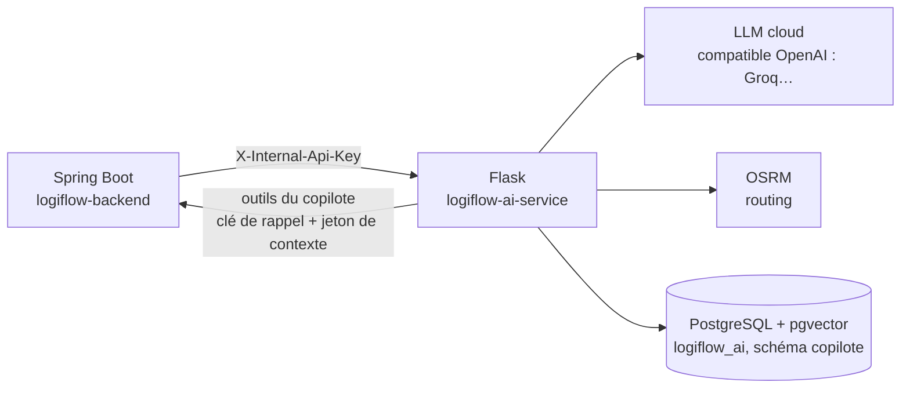
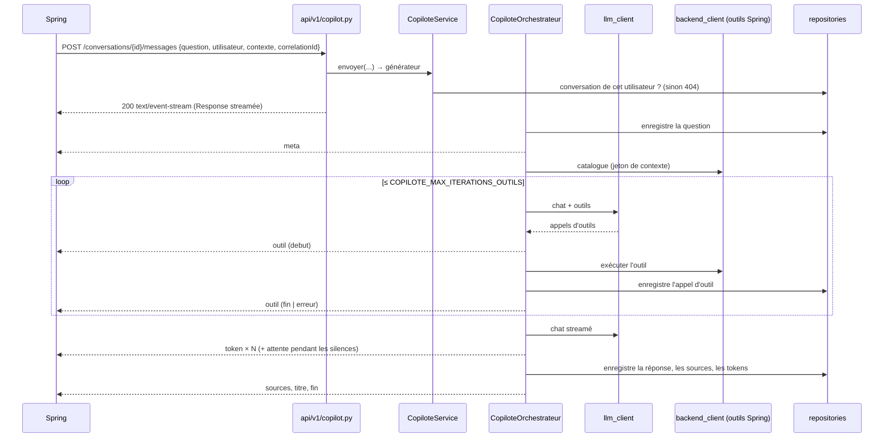

# Architecture du service IA

> Ce document décrit **l'intérieur** du service Flask. Pour la vue d'ensemble, voir dans
> `logiflow-backend` :
>
> - [`docs/agents-ia.md`](../../logiflow-backend/docs/agents-ia.md) : flux entre Angular, Spring
>   et Flask, authentification, diagrammes de séquence, règles de calcul, dégradation ;
> - [`docs/integration-ia.md`](../../logiflow-backend/docs/integration-ia.md) : contrat champ par
>   champ.

## 1. Rôle du service

`logiflow-ai-service` héberge les agents IA du TMS LogiFlow :

| Agent | Route | Nature |
|---|---|---|
| Copilote (chatbot) | `/internal/ai/v1/copilot/**` | LLM + outils métier de Spring + base de connaissance, réponses **streamées** (SSE), conversations persistées |
| Planification de voyage | `POST /internal/ai/v1/planification/proposer` | Solveur déterministe + rédaction LLM |
| Maintenance prédictive | `POST /internal/ai/v1/maintenance/recommander` | Analyse déterministe + rédaction LLM |
| Itinéraire | `POST /internal/ai/v1/itinerary/calculer` | OSRM |

Le service n'est **jamais appelé par le frontend** : seul le backend Spring Boot le consomme, sur
le réseau interne, avec la clé `X-Internal-Api-Key`.



Principes :

- **Aucun accès à la base du TMS.**
  - Planification, maintenance et itinéraire reçoivent tout leur contexte dans la requête.
  - Le copilote obtient les données en appelant les **outils** exposés par Spring, qui appliquent
    les droits de l'utilisateur.
- **Une base propre**, `logiflow_ai` (schéma `copilote`, pgvector) : conversations, messages,
  appels d'outils, avis, base de connaissance. Migrations Alembic dans `migrations/`.
- **Aucune connaissance du JWT ni de Keycloak.** L'identité de l'utilisateur (id, nom, rôles) est
  posée par Spring, et un jeton de contexte à durée courte autorise les appels d'outils pour un
  seul message.
- **LLM cloud compatible OpenAI**, choisi par configuration (`LLM_BASE_URL`, `LLM_API_KEY`,
  `LLM_MODEL`) : Groq par défaut, sur son palier gratuit. Un LLM local (Ollama) s'était montré
  trop lent sur CPU.
- **Calcul déterministe, LLM rédacteur** : chiffres, horaires et scores ne dépendent jamais du
  LLM, qui ne fait qu'expliquer. Un gabarit de texte prend le relais si le LLM est indisponible.

## 2. Structure des packages

```
src/logiflow_ai_service/
  app.py                    factory Flask : settings, logs, clients, services, blueprints, /health
  wsgi.py                   point d'entrée WSGI (gunicorn logiflow_ai_service.wsgi:app)
  config.py                 Settings (pydantic-settings), lues depuis l'environnement / .env
  security.py               vérification de X-Internal-Api-Key (toutes les routes sauf /health)
  errors.py                 gestionnaires d'erreurs : réponses JSON uniformes, 400 de validation détaillés
  schemas.py                CamelModel : base Pydantic (snake_case en Python, camelCase en JSON)
  logging_config.py         journaux JSON structurés (correlationId)
  cli.py                    commande `flask ingerer` : alimente la base de connaissance

  api/v1/                   couche HTTP, sans logique métier : valide, appelle le service, formate
    copilot.py              conversations, messages (SSE), avis, question unique
    planification.py
    maintenance.py
    itinerary.py

  agents/copilot/           copilote conversationnel
    schemas.py              requêtes et réponses HTTP
    model.py                dataclasses (Conversation, Message, AppelOutil, Source…) + protocoles des repositories
    service.py              cas d'utilisation : CRUD des conversations, envoi d'un message
    orchestrateur.py        historique + LLM + boucle d'outils → générateur d'événements SSE
    outils.py               catalogue (outils Spring + outil local de base de connaissance) et exécution
    prompts.py              prompt système (date, utilisateur, rôles, règles), prompt de titre
    battements.py           événements `attente` pendant les silences du LLM
    sse.py                  sérialisation `event:` / `data:`

  agents/planification/     agent de planification de voyage
    schemas.py              contrat (dossiers, sites, véhicules, remorques, chauffeurs → options)
    matrice.py              distances et durées : OSRM /table, repli Haversine × 1,3
    horaires.py             ETA/ETD, temps de service, pauses 45 min / 4 h 30, équipage requis
    solveur.py              compatibilités, groupes, ordre des arrêts, ressources, options par objectif
    redaction.py            justifications et comparaison (LLM, repli par gabarit)
    service.py              orchestration et mise en forme de la réponse

  agents/maintenance/       agent de maintenance prédictive
    schemas.py              contrat (engins, plans avec échéance, OT, sinistres, documents, voyages → analyses)
    analyse.py              usage, échéances, anomalies, score, statut, recommandations, créneau libre
    service.py              explications et synthèse (LLM, repli par gabarit)

  agents/itinerary/         agent itinéraire
    schemas.py, service.py  points → distance, durée, segments (OSRM /route)

  infrastructure/           clients vers l'extérieur
    llm_client.py           API compatible OpenAI : chat (streamé, avec outils), embeddings, état (/models)
    backend_client.py       outils du copilote exposés par Spring (catalogue, exécution)
    osrm_client.py          OSRM /route et /table
    db.py                   moteur SQLAlchemy
    persistence/            modèles SQLAlchemy et repositories (conversations, base de connaissance)
    exceptions.py           UpstreamServiceError, LlmQuotaError → traduites en 503 ou en événement `erreur`

migrations/                 Alembic : schéma copilote (0001), dimension d'embedding libre (0002)
tests/                      pytest : un fichier par agent et par brique, fakes et mocks HTTP (respx)
Dockerfile                  image Python 3.13 slim + uv
```

## 3. Cycle de vie d'une requête

### Agents « requête / réponse » (planification, maintenance, itinéraire)

1. `security.py` vérifie `X-Internal-Api-Key` (401 sinon).
2. Le blueprint valide le corps avec le schéma Pydantic de l'agent (400 si invalide, avec le
   détail des champs).
3. Le service de l'agent calcule le résultat de façon déterministe.
4. Il fait rédiger les textes par le LLM. En cas d'échec (`UpstreamServiceError`,
   `LlmQuotaError`, JSON invalide), il retombe sur le gabarit, et `sourceRedaction` vaut alors
   `GABARIT`.
5. La réponse est sérialisée en camelCase.
6. Une dépendance indispensable indisponible (OSRM pour l'itinéraire) donne **503**, jamais
   500. Spring distingue ainsi une panne tierce d'un bug.

### Copilote (streaming)



Si Spring ferme la connexion (bouton Stop), le générateur reçoit `GeneratorExit` : la réponse
partielle est enregistrée avec le statut `interrompu`.

## 4. Gestion des erreurs

| Situation | Agents requête / réponse | Copilote |
|---|---|---|
| Clé API absente ou fausse | 401 | 401 (avant ouverture du flux) |
| Corps invalide | 400 + détail | 400 |
| Conversation d'un autre utilisateur ou inconnue | — | 404 |
| LLM indisponible | Gabarit (200) | Événement `erreur` `LLM_INDISPONIBLE` ; message enregistré au statut `erreur` |
| Quota LLM atteint | Gabarit (200) | Événement `erreur` `QUOTA_LLM` |
| OSRM indisponible | Planification : Haversine (200) ; itinéraire : 503 | — |
| Outil Spring en erreur | — | Erreur transmise au LLM, qui peut corriger son appel ; événement `outil` au statut `erreur` |
| Exception imprévue | 500, JSON générique sans détail technique | Idem |

## 5. Observabilité

- **Journaux JSON** (`logging_config.py`) avec le `correlationId` reçu de Spring. Une même
  question se suit donc dans les journaux des deux services.
- **`GET /health`** (public) : état du service, du LLM (`UP`, `CLE_ABSENTE`, `CLE_INVALIDE`,
  `MODELE_ABSENT`, `DOWN`) et de la base. Spring l'interroge pour `GET /api/v1/ia/copilote/etat`.
- **Base `logiflow_ai`** : chaque message garde ses tokens et sa durée, chaque appel d'outil ses
  arguments, sa durée et son succès, et les avis 👍/👎 y sont conservés.

## 6. Tests

- Pas de réseau réel : le LLM, OSRM et les outils Spring sont simulés avec `respx`
  (`tests/llm_mock.py`). Les repositories en mémoire sont dans `tests/fakes.py`.
- Les solveurs (planification, maintenance) sont testés directement sur leurs fonctions pures.
- `test_persistence_sql.py` ne s'exécute que si `TEST_DATABASE_URL` pointe vers une base
  PostgreSQL + pgvector jetable.

## 7. Déploiement

- **Développement** : `make run` (serveur Flask, port 8000).
- **Conteneur** : `Dockerfile` à la racine (Python 3.13 slim, dépendances via `uv`).
  - Au démarrage, `alembic upgrade head` est appliqué, puis gunicorn est lancé avec **2 workers
    `gthread` × 8 threads** et un timeout de 180 s. Un flux du copilote dure plusieurs dizaines
    de secondes : des workers synchrones seraient bloqués un par flux.
  - Un bloc `ai-service` commenté dans `logiflow-backend/docker/docker-compose.yml` le branche
    au réseau du backend.
- **Cible** : service sur le même réseau interne que le backend, jamais exposé publiquement ;
  LLM cloud par clé API.
