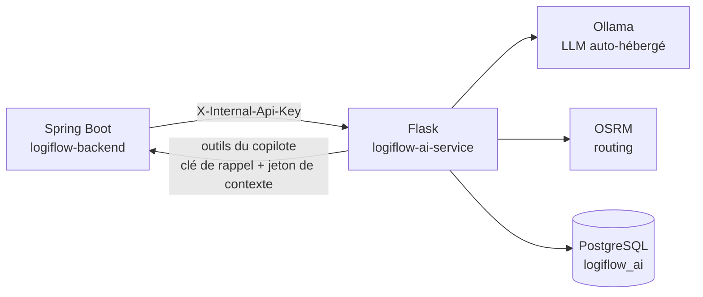

# Architecture

## Rôle du service

`logiflow-ai-service` héberge les agents IA du TMS LogiFlow (copilote conversationnel, groupage,
maintenance prédictive, itinéraire). Il n'est **jamais appelé par le frontend Angular** : seul le
backend Spring Boot (`logiflow-backend`) le consomme, en interne, via un secret partagé
(`X-Internal-Api-Key`). Voir `docs/integration-ia.md` dans `logiflow-backend` pour le contrat
complet côté appelant.



Conséquences :

- Aucun accès direct à la base de données PostgreSQL du TMS : tout ce dont un agent a besoin lui
  est transmis dans le corps de la requête HTTP par Spring Boot ou, pour le copilote, obtenu en
  appelant les outils métier exposés par Spring (`/internal/copilote/outils/**`), qui appliquent
  les droits de l'utilisateur.
- Une base **propre** au service, `logiflow_ai` (schéma `copilote`, pgvector) : conversations,
  messages, appels d'outils, avis, base de connaissance. Migrations Alembic (`migrations/`).
  Voir l'ADR 0004 dans `logiflow-backend/docs/adr/`.
- Aucune connaissance du JWT utilisateur ni de Keycloak : l'authentification utilisateur s'arrête
  au backend.
- Les modèles de langage sont servis par **Ollama**, auto-hébergé (pas d'appel à une API LLM
  tierce payante) — cohérent avec le choix d'OSRM pour le routing.

## Structure des packages

```
src/logiflow_ai_service/
  app.py                  point d'entrée (factory Flask), câble les services et les blueprints
  config.py                Settings (pydantic-settings), lues depuis l'environnement / .env
  security.py               vérification de X-Internal-Api-Key
  errors.py                  gestionnaires d'erreurs génériques (réponses JSON uniformes)
  schemas.py                 base Pydantic commune (conversion snake_case <-> camelCase)
  logging_config.py          logs JSON structurés

  api/v1/                    couche HTTP : un blueprint par agent, ne contient aucune logique
    copilot.py                métier — parse la requête, appelle le service, formate la réponse
    groupage.py
    maintenance.py
    itinerary.py

  agents/<nom>/               un module par agent
    schemas.py                  contrat Pydantic (requête/réponse), voir integration-ia.md
    service.py                  logique métier de l'agent

  agents/copilot/             chatbot
    model.py                    dataclasses + protocoles des repositories
    orchestrateur.py            historique + LLM + boucle d'outils, en événements SSE
    outils.py                   catalogue (Spring + outils locaux) et exécution
    prompts.py, sse.py

  cli.py                      `flask ingerer` : base de connaissance

  infrastructure/             clients vers les services externes
    ollama_client.py            appels au LLM (chat streamé + outils, embeddings)
    backend_client.py           outils du copilote exposés par Spring Boot
    osrm_client.py              appels au moteur de routing (agent itinéraire)
    db.py, persistence/         SQLAlchemy : modèles et repositories de logiflow_ai
    exceptions.py               UpstreamServiceError, traduite en 503 par les routes
```

Chaque route API :

1. Valide le corps de la requête via le schéma Pydantic de l'agent (`400` si invalide) ;
2. Délègue au service de l'agent, qui peut appeler un client d'infrastructure ;
3. Traduit un éventuel `UpstreamServiceError` en `503` — jamais de 500 pour une dépendance
   externe indisponible, afin que Spring Boot puisse distinguer "notre bug" de "service tiers en
   panne" et appliquer sa propre stratégie de dégradation gracieuse.

## Agents

| Agent | Route | Dépendance externe | Repli si indisponible |
|---|---|---|---|
| Copilote (chatbot) | `/internal/ai/v1/copilot/conversations/**` | Ollama, PostgreSQL, outils Spring | Sans outils (Spring injoignable) : répond sans données métier ; sans Ollama : événement `erreur` |
| Copilote (question unique) | `POST /internal/ai/v1/copilot/ask` | Ollama | Aucun (503) — pas de réponse pertinente sans LLM pour une question ouverte |
| Groupage | `POST /internal/ai/v1/groupage/analyser` | Aucune (heuristique locale) | N/A |
| Maintenance | `POST /internal/ai/v1/maintenance/recommander` | — | Non implémenté (501) |
| Itinéraire | `POST /internal/ai/v1/itinerary/calculer` | OSRM | Aucun (503) — une distance routière estimée sans moteur de routing serait trompeuse |

Le groupage n'appelle aucun service externe : c'est une heuristique de remplissage de capacité
(poids/volume/ADR), documentée dans `agents/groupage/service.py`, en attendant que le contrat
transmette les coordonnées des sites de chargement/déchargement.

## Déploiement cible

Ollama tourne sur un serveur dédié (provisionné via Terraform), le service Flask et le backend
Spring Boot dans WSL/conteneurs sur le même réseau interne — voir le dépôt d'infrastructure une
fois disponible. En attendant, `docker/docker-compose.yml` de `logiflow-backend` prévoit un bloc
`ai-service` (commenté) pointant vers ce dépôt.
